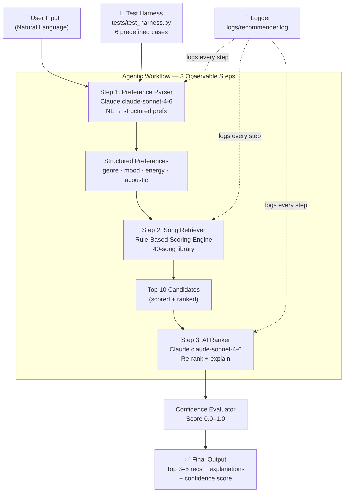

# System Architecture — AI Music Recommender

## Mermaid Diagram Source

Copy this into [Mermaid Live Editor](https://mermaid.live) and export as PNG → save as `assets/architecture.png`.

## Component Summary

| Component | File | Role |
|---|---|---|
| Preference Parser | `src/llm_client.py` | Claude converts NL to structured dict |
| Song Retriever | `src/recommender.py` | Rule-based scoring over 40-song dataset |
| AI Ranker | `src/llm_client.py` | Claude re-ranks candidates with explanations |
| Confidence Evaluator | `src/evaluator.py` | Scores match quality 0.0–1.0 |
| Agent Orchestrator | `src/ai_agent.py` | Runs and displays all 3 steps |
| Logger | `src/logger.py` | Structured JSON logging to file |
| Test Harness | `tests/test_harness.py` | Automated 6-case evaluation script |
